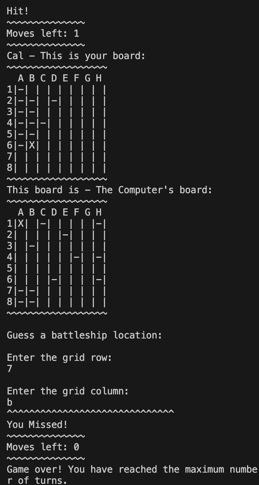
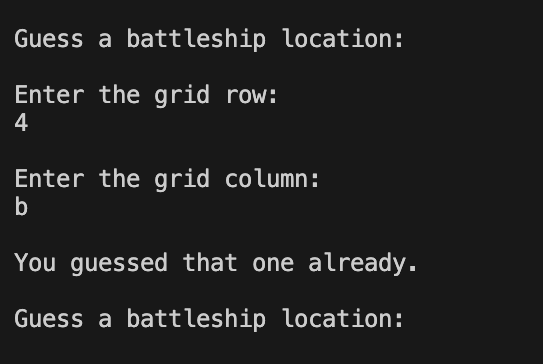

# Battleships Conquer the Seas

Battleships: Command your fleet, unleash devastation, and conquer the seas in this epic game of naval warfare!

Battlships is a Python based terminal game which runs in the Code Institute mock terminal on Heroku. Users place their own ships on the board using the grid coordinates. Its then up to the user to find where the computers ships are before the computer finds theirs!

[Here is the live version of the site](https://battle-ships-conquer-the-seas-c0107b6ccc7a.herokuapp.com/)

## How to play

Battleships is a classic game about naval warfare, sinking your opponents ships racing to hit all the opponents ships before they hit yours. You can read the full [wikipedia](https://en.wikipedia.org/wiki/Battleship_(game)) page for a better understanding.

In this version the player can insert their name and then choose the locations of their ships on a set grid. The ships are indicated by a X and then once all ships are placed they can begin against the computer.

The computer's ships are randomly generated and are hidden from the player to avoid cheating.

The player is given 15 turns to attmept to hit all 5 ships. If they dont manage to do this then the game ends. If they hit all 5 or the computer hits all 5 then the game also comes to and end congratulating the winner.

## Existing features

### Instructions:

- At the start of the game the instruction page gives all the information for the user to understand how to play and the layout of the game through the terminal

### First Coordinate:

- The user is prompted to enter their name, after pressing enter the players board is generated where they are then asked for coordinates to place their ships onto the board.

### Starting the game:

- Once all ships have been placed onto the board the game starts and both boards appear. prompting the user to take their first guess. 

### Hitting a ship

- Once you hit a ship it will be marked on the board and you will recieve a "hit" string in the terminal.

### Gameover

- After the moves are up the game will end.

### Errors

- If the user enters a coordinate more than once then the terminal will inform the user and ask it to retry

## Data Model

I decided to use a Board class as my data model.

The board class stores the board size, the number of ships, the position of the ships, the guesses against the board. It stores the players name too.

This class also has methods to help play the game such as print methods to print out the board and to provide visual aid with text separator.

## Testing

I have manually tested my project by completing the following:
- Passed the code through PEP8 validator and there are no errors showing.
- Given the inputs invalid values, numbers out of bounds, strings instead of integers. They all work fine.
- It was tested numerous times throughout deployment in my own terminal and the Code institute Heroku terminal

## Bugs

- I encountered an issue with using external add ons for fonts, the format kept coming back incorrectly and unreadable. I was not able to fix this and therefore made the decision to leave it out this project.
- I ran into a few code related issues but these were mainly single digit typos or curly braces in the wrong places.
- My original code at the start was not working the way I intended so I decided to rewrite the majority of the code again using points from the code I had already written and this then achieved the desired outcome.

## Validator Testing

- PEP8 was used to check for errors in the code and it returned with no errors or issues.

## Deployment

- This project was deployed using the code Institute mock terminal for Heroku